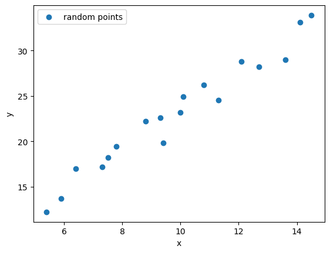
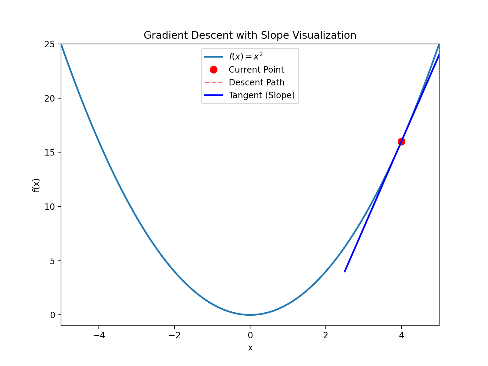

In this chapter, we introduce the overall structure of machine learning using the simplest example.

## The Simplest Machine Learning Model

This is a basic linear regression model: given 18 points, find a line that is closest to each point.

Now let's use machine learning methods to find this line.

### Define the Model

We know the equation of a line is:
$$
y = ax+b
$$

We use it as our model, where $a$ and $b$ are the parameters we need to train using machine learning.

### Loss Function

Our goal is to find $a$ and $b$ such that all points are closest to the line. Expressing this goal mathematically:
$$
l = \sum_{i=1}^{n} |y_i - y_i'|
$$

That is:
$$
l(a,b) = \sum_{i=1}^{n} |y_i - (ax_i + b)|
$$

Since absolute value is a discontinuous function and cannot be differentiated, we typically use the square method:
$$
l(a,b) = \sum_{i=1}^{n} \sqrt{(y_i - (ax_i + b))^2}
$$

Since square root calculation is complex, we generally use a simpler approach:
$$
l(a,b) = \sum_{i=1}^{n} \dfrac{1}{2}(y_i - (ax_i + b))^2
$$

Using 1/2 instead of square root makes optimization simpler and gradient calculation easier, without changing the optimal solution.

According to this formula, our goal is to find $a$ and $b$ that minimize $l$.

## Gradient Descent

Now we have a quadratic curve $y=x^2$. How do we determine if a point $(2,4)$ on the curve is an extremum (maximum or minimum)?

It's simple: just check if the derivative at $(2,4)$ is zero. The derivative curve is $y'=2x$. At point $(2,4)$, the derivative is 4, so it's clearly not an extremum.

How to find the extremum? The derivative equals zero at the extremum point. Let $2x=0$, we get $x=0$. Substituting back into $y=x^2$, we get $(0,0)$, which is an extremum. The second derivative is $y'' = 2 > 0$, so this point is a minimum.

Is there a simple method that only requires simple repetitive calculations to find the extremum? Yes, here's the method for finding the minimum of a convex function:

We randomly choose a point $(x,y)$ as the starting point, then iterate:

1. Calculate the derivative $y'(x)$ at point $(x,y)$
2. Check if the derivative is close to 0; if yes, we've found the minimum and stop
3. Use the update formula: $x_{new} = x - \eta \cdot y'(x)$, where $\eta$ is the learning rate (a small positive number)
4. Calculate the new $y$ value: $y_{new} = f(x_{new})$
5. Return to step 1 and repeat

**Key point**: Regardless of whether the derivative is positive or negative, we always subtract $\eta \cdot y'(x)$, moving in the negative gradient direction (descent direction).

For example, starting at $(4, 16)$ (note $4^2=16$), the derivative is $y'(4)=8 > 0$, then calculate:
$$x_{new} = 4 - 0.1 \times 8 = 3.2$$
$$y_{new} = 3.2^2 = 10.24$$
Continue iterating until converging to $(0, 0)$.

This process is like descending a mountain. Imagine being blindfolded and dropped somewhere on a mountain. Your goal is to descend. You just need to feel the direction of the slope and walk step by step in that direction.

In univariate quadratic equations, the derivative is called the slope. In multivariate equations, the derivative is called the gradient. That's why this method is called **Gradient Descent**.

## Summary

- Linear regression is the simplest machine learning model
- The core goal of learning is to **minimize the loss function**
- Gradient descent is the most fundamental and important optimization method
- Almost all modern deep learning is an extension of this idea

In the next chapter, we will extend this idea to:

- Multi-dimensional input
- Non-linear models
- Basic structure of neural networks
